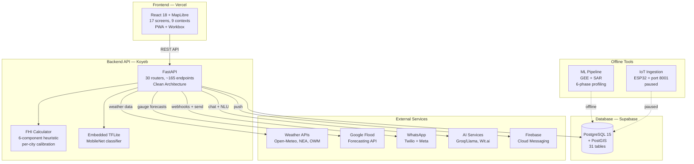

<div align="center">
  
  <h1>FloodSafe</h1>
  <p><strong>Open-source flood monitoring platform for flood-prone cities</strong></p>
  <p>Community Intelligence · AI Risk Assessment · Safe Routing · Multi-Channel Alerts</p>

  
  
  
  
  
  
  
  
  
</div>

---

## Why FloodSafe

Every monsoon and wet season, cities across Asia face devastating urban flooding. The 2023 Yamuna floods displaced over 25,000 people in Delhi alone; Singapore sees flash floods from intense tropical rainfall; Yogyakarta contends with river overflows during the rainy season. Waterlogging paralyzes transportation, endangers lives, and disproportionately impacts low-income communities who rely on public transit and live in flood-prone areas.

**FloodSafe addresses this with four pillars:**

- **Community Intelligence** — Citizens report flooding in real-time with GPS-verified photos. An AI chat provides location-aware risk assessments. Personal flood pins track risk at locations you care about. 3,217 historical flood episodes provide deep context. Safety circles keep families and neighborhoods connected during emergencies.

- **AI-Powered Risk Assessment** — A custom Flood Hazard Index (FHI) scores waterlogging risk at 499 known hotspots across 5 cities using live weather data and per-city calibration. A MobileNet classifier detects flooding in photos. Google Flood Forecasting provides Yamuna gauge predictions. Scenario simulation answers "what if 50mm of rain falls in 3 hours?"

- **Safe Routing** — A route planner that avoids high-risk flood zones with 300-meter safety buffers, with live turn-by-turn voice navigation in English, Hindi, and Indonesian. Metro integration suggests Delhi Metro and Singapore MRT alternatives when routes cross flood zones.

- **Multi-Channel Alerts** — Watch area notifications, 8 government and institutional alert sources, FCM push notifications, safety circle alert fanout, and a WhatsApp bot with dual transport (Twilio + Meta Cloud API) that supports flood reporting via photo — meeting people where they already communicate.

FloodSafe is a nonprofit project built for social good. **Try it live at [floodsafe.live](https://floodsafe.live)**.

---

## For City Partners

FloodSafe is designed to be deployed in any flood-prone city. Here's what each city gets and what's needed to add yours.

### Current City Coverage

| City | Hotspots | Weather Source | Alert Sources | FloodHub | Special |
|------|:--------:|:-------------:|:-------------:|:--------:|---------|
| **Delhi NCR** | 90 | Open-Meteo | All 8 + IMD | 1 CWC gauge (Yamuna) | 45 historical events, 281+ search aliases |
| **Bangalore** | 200 | Open-Meteo | GDACS + IMD | — | 8-zone BBMP official mapping |
| **Yogyakarta** | 76 | OWM 3.0 | GDACS + bilingual ID | — | BPBD + PetaBencana data |
| **Singapore** | 60 | NEA (5-min) | PUB + GDACS + Telegram | — | MRT 6-line integration |
| **Indore** | 73 | Open-Meteo | GDACS + IMD | — | 440–650m elevation calibration |

**499 total hotspots** across 5 cities in 3 countries. Each city has per-city FHI calibration tuned to local elevation, wet season, urban density, and rain-gate thresholds.

### What's Needed to Add a New City

| Requirement | Description |
|-------------|-------------|
| **Hotspot data** | Government flood reports, news sources, or community mapping (minimum ~30 locations) |
| **Weather API** | Open-Meteo is free and works globally; city-specific APIs (NEA, OWM) preferred for accuracy |
| **FHI calibration** | Elevation range, wet season months, urban fraction, rain-gate threshold |
| **Alert sources** | Government weather/flood agencies, RSS feeds, Telegram channels |
| **Search aliases** | Local place names and abbreviations (optional, improves UX) |
| **Emergency contacts** | City-specific emergency numbers (police, disaster management, utilities) |

---

## Features

### Flood Intelligence

| Feature | Description |
|---------|-------------|
| **Flood Hazard Index (FHI)** | Custom 6-component heuristic: `0.35×P + 0.18×I + 0.12×S + 0.12×A + 0.08×R + 0.15×E`. Weights empirically tuned (not from published research). 14-day exponential decay for soil saturation, ceiling-only P95 percentiles from ERA5, per-city calibration with rain-gate thresholds. Weather sources: Open-Meteo, NEA (Singapore, 5-min), OpenWeatherMap (Yogyakarta) |
| **Waterlogging Hotspots** | 499 locations across 5 cities with live FHI color coding (green/yellow/orange/red). Per-city data: 90 Delhi (MCD + OSM), 200 Bangalore (BBMP), 76 Yogyakarta (BPBD + PetaBencana), 60 Singapore (PUB), 73 Indore (IMC + news) |
| **Google Flood Forecasting** | Live API — Delhi Yamuna gauge (CWC_015-UYDDEL), 28-hour forecasts, 3-tier thresholds (warning/danger/extreme), inundation maps (KML→GeoJSON), significant events with population impact. 5 endpoints |
| **Flood Photo Classifier** | MobileNet v1 via TFLite, threshold 0.3 (safety-first to minimize false negatives) |
| **Historical Floods** | 45 Delhi NCR events (1969–2023) from the IFI-Impacts dataset + 3,217 Groundsource episodes with 125 clusters |
| **External Alerts** | 8 sources: IMD, CWC, RSS feeds, Twitter/X, GDACS, GDELT, news, PUB Telegram (Singapore). Severity-scored, deduplicated, with APScheduler refresh |
| **FHI Validation** | Checked against 20 documented Delhi flood events to ensure scores exceed alert threshold. This is calibration, not independent scientific validation |

### AI & Risk Insights

| Feature | Description |
|---------|-------------|
| **AI Chat** | Groq Llama-backed conversational risk assessment. 5-turn memory, 30-min TTL, 200 conversation LRU cache. Auto-geocodes location mentions, computes real FHI, and injects into context |
| **Address Risk** | Geocode any address → compute FHI → generate natural language risk narrative |
| **Alert Summary** | Aggregates active alerts into natural language summaries |
| **Scenario Simulation** | "What if 50mm rain in 3 hours?" → FHI projection using per-city calibration |

### Community & Reporting

| Feature | Description |
|---------|-------------|
| **Flood Reports** | Photo upload with GPS/EXIF verification, severity tagging, city auto-detection. Creation triggers a 6-stage pipeline: EXIF→city detect→FHI enrich→weather snapshot→circle notify→gamification points |
| **Voting & Comments** | Upvote/downvote with deduplication (one vote per user per report), comments with rate limiting (5/min) |
| **WhatsApp Reporting** | Send photo + location via WhatsApp → ML classifies image → auto-creates flood report. Works on both Twilio and Meta transports |
| **Gamification** | Points for verified reports, 4 badge categories, daily streaks, leaderboards with privacy controls |

### Safety Circles & SOS

| Feature | Description |
|---------|-------------|
| **Safety Circles** | Create circles (family/school/apartment/neighborhood/custom) with 8-char invite codes. Roles: creator > admin > member. Non-registered phone contacts supported, auto-upgrade on registration. 15 API endpoints |
| **Circle Alert Fanout** | When a member reports flooding, all circle members get WhatsApp/SMS alerts. Dedup, throttle (max 50 per circle per report), creator exclusion, no silent fallbacks — every failure tracked |
| **SOS Emergency** | One-tap SOS with offline queue (IndexedDB + Background Sync). Service worker delivers when online. Per-recipient delivery tracking (sent/partial/failed) |
| **Deep Links** | `?join=CODE` URL parameter for circle invites, stored through login flow |

### Watch Areas & Personal Pins

| Feature | Description |
|---------|-------------|
| **Watch Areas** | User-defined monitoring zones with PostGIS spatial queries and custom radius. FHI scoring and history tracking |
| **Personal Pins** | Drop pins at locations you care about (25 limit). 4 radius options (100m/300m/500m/1km). FHI compute, historical episode count within 2km, road info. MapLibre layer with FHI-colored markers |
| **Watch Hotspot** | One-click pin creation from any hotspot detail panel |
| **Push Notifications** | Firebase Cloud Messaging for watch area + circle alert triggers. Foreground and background paths, stale token auto-cleanup |

### Safe Routing & Navigation

| Feature | Description |
|---------|-------------|
| **Route Comparison** | Side-by-side normal vs flood-safe routes with distance, time, and risk comparison |
| **Hotspot Avoidance** | HARD AVOID for HIGH/EXTREME FHI zones (300m buffer). LOW/MODERATE: warning overlay only |
| **Metro Integration** | Delhi Metro + Singapore MRT (6 lines, official colors) station suggestions when routes cross flood zones |
| **Live Navigation** | Turn-by-turn with voice guidance (en-IN, hi-IN, id-ID), direction arrow, real-time hotspot proximity warnings, auto-reroute |
| **Saved Routes** | Bookmark routes with use-count tracking across 3 transport modes (driving, walking, cycling) |

### WhatsApp Bot

| Feature | Description |
|---------|-------------|
| **Dual Transport** | Twilio (TwiML, form-encoded) + Meta Cloud API (Graph API, HMAC-SHA256 signature). Shared session model + message templates |
| **NLU** | Wit.ai with 7 intents (check_risk, report_flood, get_warnings, check_status, get_help, get_my_areas, greet), confidence threshold 0.5 |
| **Commands** | RISK, WARNINGS, MY AREAS, STATUS, LINK, START/STOP. Circle management via tap-based menus (Meta) or text commands (Twilio) |
| **Onboarding** | Welcome → city selection → watch area setup, all via WhatsApp conversation |
| **Photo Reporting** | Photo + location → ML classify → auto-create flood report with FHI enrichment |
| **AI Summaries** | Groq/Llama risk narratives with 1hr cache |
| **Languages** | English, Hindi, Indonesian (Meta transport supports all 3) |
| **Session** | State machine (idle→awaiting_choice→awaiting_email→sos_active), 30-min timeout, 10 msg/min rate limit |

### Admin Dashboard

32 API endpoints covering:

- **User Management** — List, detail, role changes (user→verified_reporter→moderator→admin→banned), ban/unban, delete
- **Report Moderation** — Verification queue, approve/reject with notes, archive
- **Badge Management** — Create, update, award to users
- **Ambassador Program** — Candidate identification, promotion
- **Analytics** — User counts, report stats, per-city breakdowns
- **Invite System** — 8-char codes with 48-hour expiry for multi-admin onboarding
- **Community Intelligence** — Cluster review, personal pin management, pin relocation
- **Audit Trail** — All admin actions tracked via AdminAuditLog

### Smart Search

| Feature | Description |
|---------|-------------|
| **Dual Geocoding** | Photon (typo-tolerant) + Nominatim (authoritative), proximity-sorted, deduplicated |
| **Fuzzy Matching** | Three layers: Photon server-side → backend difflib (281+ aliases) → frontend subsequence (70% overlap) |
| **Intent Detection** | Distinguishes location, report, and user searches with @-prefix patterns |

### Progressive Web App

| Feature | Description |
|---------|-------------|
| **Offline Support** | Workbox service worker with CacheFirst, NetworkFirst, and StaleWhileRevalidate strategies |
| **Installable** | Install banner for Android/desktop, dedicated iOS install prompt, standalone display mode |
| **Offline SOS** | Emergency SOS queued via IndexedDB when offline, delivered via Background Sync when connectivity returns |
| **Push Notifications** | FCM via separate Firebase Messaging Service Worker |

### WebMCP Bridge (AI Agent Interface)

13 entities enabling AI agents to interact with FloodSafe programmatically:

- **Contexts (2)**: App state (city, auth, gamification) + location (GPS, nearby hotspots with FHI)
- **Tools (3)**: `search_locations`, `get_query_cache`, `switch_city`
- **Resources (5)**: Config, alerts/{city}, hotspots/{city}, reports, floodhub/{city}
- **Prompts (3)**: Analyze flood risk, debug UI state, verify city integration

### IoT Sensors (Experimental — Paused)

ESP32-based water level monitoring with dual sensor fusion (capacitive strips + VL53L0X ToF), OLED display, and 100-reading offline buffer. High-throughput ingestion service on port 8001. Currently paused — contributions welcome.

---

## Tech Stack

| Layer | Technologies |
|-------|-------------|
| **Frontend** | React 18, TypeScript 5.x, Vite, Tailwind CSS v4, Radix UI, MapLibre GL JS, TanStack Query v5, Workbox, Capacitor 8 (Android) |
| **Backend** | FastAPI, SQLAlchemy 2.0, Pydantic v2, PostGIS, APScheduler |
| **AI / ML** | FHI Calculator (custom heuristic), TFLite MobileNet, Groq (Llama 3.1), Wit.ai NLU, Google Flood Forecasting API |
| **Database** | PostgreSQL 15 + PostGIS (SRID 4326), 31 tables |
| **Auth** | Email/Password (bcrypt), Google OAuth, Phone OTP (Firebase), JWT with refresh token rotation |
| **Maps** | MapLibre GL JS, PMTiles (offline tiles), OpenStreetMap, Photon + Nominatim geocoding |
| **Messaging** | Twilio (WhatsApp + SMS), Meta WhatsApp Cloud API, Firebase Cloud Messaging, SendGrid |
| **AI Services** | Wit.ai (NLU, 7 intents), Groq (Llama 3.1-8b, chat + risk summaries), Meta Llama API (fallback) |
| **Deploy** | Vercel (frontend), Koyeb (backend), Supabase (database) |
| **Testing** | Playwright (E2E + visual), TypeScript strict mode |

---

## Architecture



### Key Data Flows

**Report Creation → Circle Notification:**
```
User submits report (photo + location)
  → EXIF extraction → city auto-detection
  → FHI enrichment → weather snapshot capture
  → Store report (PostGIS POINT)
  → Gamification points awarded
  → Query circles where reporter is member
  → Create CircleAlert per member (dedup D2, throttle D3 max 50)
  → WhatsApp/SMS dispatch to circle members
  → Query watch areas (PostGIS ST_DWithin)
  → Create Alert per matching watch area
  → FCM push notification to watch area owners
```

**FHI Calculation Pipeline:**
```
Weather API request (Open-Meteo / NEA / OWM)
  → Extract 6 components (P, I, S, A, R, E)
  → Rain-gate check: below city threshold → cap at 0.15
  → Weighted sum: 0.35×P + 0.18×I + 0.12×S + 0.12×A + 0.08×R + 0.15×E
  → Urban terrain correction (1.5x–2.25x)
  → Final FHI score (0–1)
  → Color: green (<0.2) / yellow (0.2–0.4) / orange (0.4–0.7) / red (>0.7)
```

**WhatsApp Photo Reporting:**
```
User sends photo + location via WhatsApp
  → Meta webhook (HMAC-SHA256 validated) or Twilio webhook
  → Rate limit check (10/min)
  → Download photo via Bearer token
  → MobileNet classify: flood/no_flood (threshold 0.3)
  → If flood: auto-create report with location + FHI
  → If no flood: ask user to confirm or cancel
```

---

## ML Methodology

### Active Models

| Model | Purpose | Details |
|-------|---------|---------|
| **FHI Calculator** | Real-time waterlogging risk (0–1) | Custom heuristic with 6 weather components. Per-city calibration for elevation, wet season, urban density, and rain-gate threshold. Checked against 20 documented Delhi flood events for calibration (not independent scientific validation) |
| **MobileNet Classifier** | Flood photo detection | TFLite, 224×224 input, threshold 0.3. Safety-first: minimizes false negatives |

### AI Services

| Service | Provider | Purpose |
|---------|----------|---------|
| **Groq** | Llama 3.1-8b | AI chat, risk summaries, scenario simulation. 120 req/min, 2000 req/day |
| **Wit.ai** | Meta | NLU for WhatsApp. 7 intents, 51 utterances, EN/HI |
| **Meta Llama** | Meta | Fallback for Groq when rate-limited |

### Retired

**XGBoost Hotspot Model** — Achieved AUC 0.98 but was measuring urban-vs-rural classification, not actual flood risk. The model's top features (built-up percentage, vegetation, impervious surface) perfectly separated city centers from rural areas, creating an artifact. Retired March 2026. See the [methodology postmortem](docs/plans/2026-03-07-ml-methodology-postmortem.md) for the full analysis.

### Research Pipeline (Offline)

A 6-phase city-specific profiling pipeline using Google Earth Engine terrain/land cover extraction and Sentinel-1 SAR temporal contrast. Statistical methods: Mann-Whitney U, Cliff's Delta (effect size), Moran's I (spatial autocorrelation), Benjamini-Hochberg correction. Phases 0–4 complete, 5–6 pending. This pipeline runs offline and does not serve production predictions.

---

## API Overview

The backend exposes **30 routers with ~165 endpoints**. Full Swagger docs available at `/docs`.

| Group | Routers | Endpoints | Description |
|-------|---------|:---------:|-------------|
| **Auth** | auth, otp | ~16 | Email register/login, Google OAuth, Phone OTP, token refresh/rotation, password reset, email verification |
| **Users** | users | ~11 | Profile CRUD, tour completion, role management, nearby reporters |
| **Reports** | reports, comments, ml | ~14 | Flood reports with 6-stage pipeline, voting, comments (5/min rate limit), ML photo classification |
| **Flood Data** | hotspots, rainfall, predictions, historical_floods, floodhub, external_alerts | ~40 | FHI calculator (12 endpoints), 499 hotspots, FloodHub (5), external alerts (5), historical + Groundsource (8) |
| **AI** | ai_chat | 4 | AI chat, address risk, alert summary, scenario simulation |
| **Routing** | routes_api, saved_routes, daily_routes | ~15 | Route comparison, metro suggestions, saved routes, daily commutes |
| **Alerts** | alerts, watch_areas | ~15 | Unified alerts, watch area CRUD, personal pins, FHI history |
| **Social** | gamification, badges, reputation, leaderboards | ~12 | Points, badges, streaks, leaderboards, privacy controls |
| **Safety** | circles, sos | ~16 | Safety circles (15 endpoints), SOS emergency fanout |
| **Messaging** | webhook, whatsapp_meta | ~5 | Dual WhatsApp transport (Twilio + Meta Cloud API) |
| **Push** | push | 2 | FCM token registration/deletion |
| **Admin** | admin | ~32 | User/report/badge management, analytics, invites, audit log, cluster review, pin management |
| **IoT** | sensors | ~6 | Sensor CRUD, readings, API key auth (paused) |

---

## Project Structure

```
FloodSafe/
├── apps/
│   ├── backend/                 # FastAPI backend
│   │   └── src/
│   │       ├── api/             # 30 router modules (~165 endpoints)
│   │       ├── domain/
│   │       │   ├── services/    # 32+ service files
│   │       │   └── ml/          # Embedded TFLite classifier
│   │       ├── infrastructure/  # SQLAlchemy models (31), database, storage
│   │       └── core/            # Config (50+ settings), utils, circuit breaker
│   ├── frontend/                # React 18 + TypeScript PWA
│   │   ├── android/             # Capacitor 8 Android wrapper
│   │   └── src/
│   │       ├── components/
│   │       │   ├── screens/     # 17 screen components
│   │       │   ├── ui/          # 44 Radix UI primitives
│   │       │   ├── circles/     # 10 Safety Circle components
│   │       │   ├── floodhub/    # 6 FloodHub components
│   │       │   ├── ai-chat/     # AI chat FAB + panel
│   │       │   ├── gamification/ # Badges, leaderboard, reputation, streaks
│   │       │   ├── onboarding-bot/ # 2-phase multilingual tour (EN/HI/ID)
│   │       │   └── landing/     # Landing page components
│   │       ├── contexts/        # 9 React contexts
│   │       ├── hooks/           # Push notifications, SOS queue, GPS simulator
│   │       └── lib/
│   │           ├── api/         # fetchJson client, 40+ TanStack Query hooks
│   │           ├── map/         # MapLibre config, useMap, cityConfigs (5 cities)
│   │           └── auth/        # Token storage, SW token cache
│   ├── ml-service/              # ML prediction service (inactive)
│   ├── ml-pipeline/             # Offline profiling pipeline (GEE + SAR)
│   ├── iot-ingestion/           # Sensor ingestion service (port 8001, paused)
│   └── esp32-firmware/          # Arduino firmware (XIAO ESP32S3, paused)
├── docker-compose.yml
├── CLAUDE.md                    # AI development guide
└── FEATURES.md                  # Feature registry (1300+ lines)
```

---

## Getting Started

### Prerequisites

- Docker Desktop
- Node.js 18+
- Python 3.11+

### Docker (Full Stack)

```bash
git clone https://github.com/aniru888/floodsafe-mvp.git
cd FloodSafe
docker-compose up -d
```

| Service | URL |
|---------|-----|
| Frontend | http://localhost:5175 |
| Backend API | http://localhost:8000 |
| API Docs (Swagger) | http://localhost:8000/docs |

### Local Development

```bash
# Start database
docker-compose up -d db

# Backend
cd apps/backend
cp .env.example .env          # Set DATABASE_URL to localhost:5432
python -m uvicorn src.main:app --reload

# Frontend (in a separate terminal)
cd apps/frontend
npm install
npm run dev                   # Runs on port 5175
```

### Environment Variables

Each service has a `.env.example` file. Key variables:

| Variable | Service | Purpose |
|----------|---------|---------|
| `DATABASE_URL` | Backend | PostgreSQL connection string |
| `JWT_SECRET_KEY` | Backend | Authentication token signing (min 32 chars) |
| `VITE_API_URL` | Frontend | Backend API URL |
| `VITE_FIREBASE_*` | Frontend | Firebase config (6 vars) |
| `TWILIO_*` | Backend | WhatsApp/SMS (account SID, auth token, number) |
| `META_WHATSAPP_TOKEN` | Backend | Meta WhatsApp Cloud API token |
| `META_PHONE_NUMBER_ID` | Backend | Meta WhatsApp phone number ID |
| `META_APP_SECRET` | Backend | Meta webhook HMAC signature validation |
| `GROQ_API_KEY` | Backend | Groq API for AI chat and risk summaries |
| `WIT_AI_TOKEN` | Backend | Wit.ai NLU for WhatsApp command classification |
| `GOOGLE_FLOODHUB_API_KEY` | Backend | Google Flood Forecasting API access |
| `FIREBASE_SERVICE_ACCOUNT_B64` | Backend | Base64-encoded Firebase service account (FCM push) |
| `NEA_API_KEY` | Backend | Singapore NEA weather data (optional) |
| `OPENWEATHERMAP_API_KEY` | Backend | Yogyakarta OWM One Call 3.0 (optional) |
| `SENDGRID_API_KEY` | Backend | Email verification via SendGrid |

---

## Roadmap

| Tier | Name | Status |
|:----:|------|--------|
| 1 | **Community Intelligence** | Complete — Reports, auth, alerts, onboarding, voting, comments, gamification, E2E tests |
| 2 | **AI/ML Foundation** | Mostly complete — FHI calculator (active), MobileNet (active), FloodHub (live), AI chat (active), historical floods, external alerts. XGBoost retired. Ensemble not trained. Profiling pipeline in progress |
| 3 | **Smart Sensors** | Paused — ESP32 firmware and ingestion built; edge ML not yet implemented |
| 4 | **Smart Features** | Complete — Safe routing, saved routes, smart search, live navigation, metro integration |
| 5 | **Messaging & Alerts** | Complete — WhatsApp dual transport, Wit.ai NLU, AI risk summaries, FCM push, SOS, safety circles |
| 6 | **Mobile & Offline** | Mostly complete — PWA (Workbox), install banner, offline SOS, Capacitor Android initialized (no native plugins yet) |
| 7 | **Community Intelligence v2** | Complete — AI chat, personal pins, admin cluster management, Groundsource data, scenario simulation |

### What's Next

- [ ] Native Capacitor plugins (push, geolocation, camera)
- [ ] Play Store release
- [ ] Multi-language UI (Hindi, Kannada, Indonesian)
- [ ] GNN for flood propagation modeling
- [ ] Cloud photo storage (S3)
- [ ] Water depth estimation from photos
- [ ] Edge ML on IoT devices
- [ ] ML pipeline phases 5–6 (SAR temporal analysis, output generation)

---

## Contributing

FloodSafe is a nonprofit project — contributions are welcome.

1. Read [`CLAUDE.md`](./CLAUDE.md) for development patterns and architecture rules
2. Read [`FEATURES.md`](./FEATURES.md) for the full feature registry (1300+ lines of domain context)
3. Open an issue before starting large changes

**Quality gates** (all must pass before merge):
```bash
cd apps/frontend && npx tsc --noEmit   # Type safety
cd apps/frontend && npm run build       # Production build
cd apps/backend && pytest               # Backend tests
```

---

## License

FloodSafe is a nonprofit project built for social good. Contact for licensing inquiries.

---

<div align="center">
  <sub>Built with purpose. Saving lives through technology.</sub>
</div>
