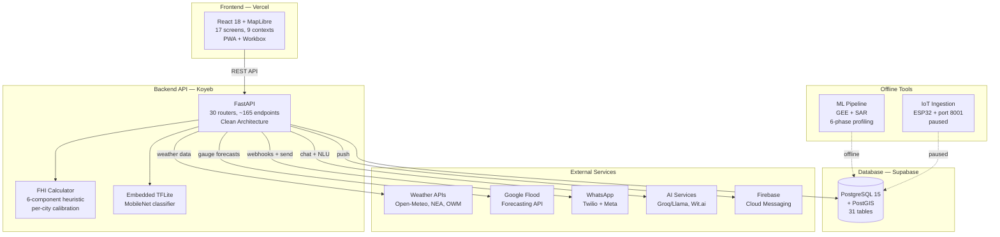
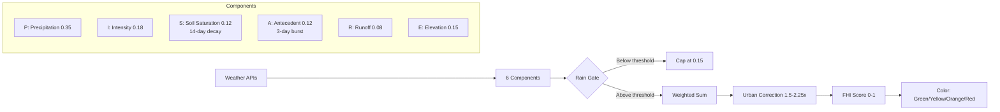
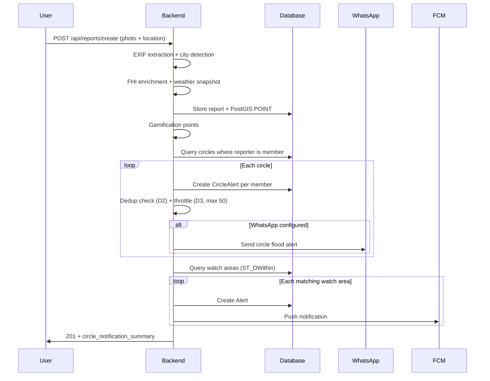
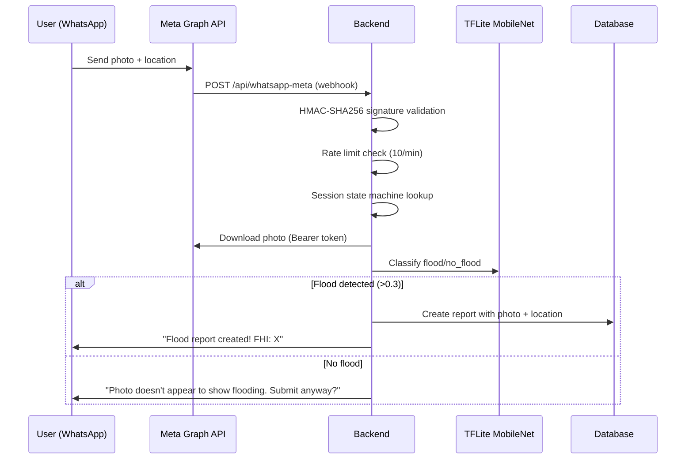

# README & FEATURES.md Overhaul — Design Spec

> **Date**: 2026-03-17
> **Scope**: Complete rewrite of README.md + corrections to FEATURES.md
> **Audience**: Technical showcase for engineers + evaluation document for NGO/government partners
> **Verification**: All facts verified via Serena (symbol-level), CGC (complexity), and FEATURES.md cross-reference

---

## 1. Goals

1. **Pin-to-pin accuracy** — every number, endpoint count, model name, and feature claim verified against actual code
2. **Honest ML narrative** — retire XGBoost claims, lead with FHI calculator (what's actually working)
3. **Partner-friendly** — new "For City Partners" section for NGOs/government evaluating FloodSafe
4. **Architecture updated** — Mermaid diagrams, correct component counts, critical path data flows
5. **Missing features documented** — AI Chat, Personal Pins, Community Intelligence, WhatsApp reporting, WebMCP Bridge, Admin Dashboard (32 endpoints)
6. **FEATURES.md corrections** — fix 6 stale numbers (contexts, models, admin endpoints, auth endpoints, rainfall endpoints, API file count)

---

## 2. Verified Ground Truth (Serena + CGC)

### 2.1 Backend Architecture

| Metric | README (old) | Actual (Serena-verified) |
|--------|:------------:|:------------------------:|
| Routers mounted | 33 | **30** (`main.py:106-135`, counted each `app.include_router`) |
| Total endpoints | 120+ | **~165** (sum of all route handler functions across 30 routers) |
| Database models | 27 | **31** (all classes in `infrastructure/models.py`) |
| Domain services | not stated | **32+** files in `domain/services/` |

**30 Routers (exact list from `main.py`):**
1. `auth` → `/api/auth` (14 endpoints: google_auth, phone_auth, register_email, login_email, refresh_token, logout, logout_all, get_current_user_profile, check_auth, verify_email, resend_verification, get_verification_status, forgot_password, reset_password)
2. `webhook` → `/api/whatsapp` (Twilio)
3. `whatsapp_meta` → `/api/whatsapp-meta` (Meta Cloud API — 3 endpoints + ~20 internal handlers)
4. `reports` → `/api/reports` (10: list, get_user, get_location_details, create, get_hyperlocal_status, verify, upvote, downvote, get_archived, get_stats)
5. `users` → `/api/users` (10: get_my_profile, mark_tour_complete, update_my_profile, create_user, list_users, get_user, get_active_reporters_count, get_nearby_reporters_count, get_leaderboard, update_user, update_user_role)
6. `sensors` → `/api/sensors` (6: CRUD + readings + API key)
7. `otp` → `/api` (2: send, verify)
8. `watch_areas` → `/api/watch-areas` (10: create, get_user, list_my_pins, get, delete, get_risks, create_pin, watch_hotspot, refresh_fhi, get_fhi_history)
9. `daily_routes` → `/api/daily-routes`
10. `reputation` → `/api/reputation`
11. `leaderboards` → `/api/leaderboards`
12. `badges` → `/api/badges` (4: get_my_badges, get_my_reputation, get_my_reputation_history, get_badges_catalog)
13. `routes_api` → `/api` (7: calculate_route, get_nearby_metros, calculate_walking_route, compare_routes, health, compare_routes_enhanced, recalculate_route)
14. `alerts` → `/api/alerts` (5: get_user_alerts, get_unread_count, mark_read, mark_all_read, get_unified_alerts)
15. `external_alerts` → `/api` (5: get, get_sources, refresh, get_stats, cleanup)
16. `search` → `/api` (5: unified, locations, reports, users, suggestions)
17. `predictions` → `/api/predictions`
18. `saved_routes` → `/api` (5: get_user, create, update, delete, increment_usage)
19. `historical_floods` → `/api/historical-floods` (8: get_historical_floods, get_stats, health + 5 Groundsource endpoints)
20. `hotspots` → `/api/hotspots` (5: get_all, get_risk, get_risk_at_point, get_summary, health)
21. `rainfall` → `/api/rainfall` (12: forecast, forecast/grid, FHI, nea-rainfall, sg-conditions, sg-forecast, yk-conditions, yk-forecast, health, validate/historical/{id}, validate/all, validate/summary)
22. `gamification` → `/api/gamification` (4: badges, reputation, reputation_history, badges_catalog)
23. `comments` → `/api`
24. `ml` → `/api/ml`
25. `floodhub` → `/api` (5: status, gauges, forecast, inundation, events)
26. `circles` → `/api/circles` (15: create, list, get_alerts, mark_alert_read, mark_all_read, get_unread_count, get_detail, update, delete, add_member, add_members_bulk, remove_member, update_member, join, leave)
27. `sos` → `/api/sos` (1: send_sos)
28. `push` → `/api` (2: register, unregister)
29. `admin` → `/api/admin` (32: login, dashboard_stats, list_users, get_user_detail, update_role, ban, unban, delete_user, create_report, list_reports, verify_report, archive_report, delete_report, list_badges, create_badge, update_badge, award_badge, get_ambassadors, promote_ambassador, analytics_reports, analytics_users, analytics_cities, health, audit_log, create_invite, list_invites, revoke_invite, register_admin, list_clusters, review_cluster, list_personal_pins, relocate_pin)
30. `ai_chat` → `/api/ai` (4: chat, address_risk, alert_summary, simulate_scenario)

**31 Database Models:**
User, Sensor, Reading, Report, FloodZone, WatchArea, DailyRoute, Alert, ReputationHistory, RoleHistory, Badge, UserBadge, RefreshToken, EmailVerificationToken, PasswordResetToken, SavedRoute, ReportVote, Comment, ExternalAlert, WhatsAppSession, SafetyCircle, CircleMember, CircleAlert, SOSMessage, AdminAuditLog, AdminInvite, CityRoad, CandidateHotspot, HistoricalFloodEpisode, GroundsourceCluster, WatchAreaFhiHistory

### 2.2 Frontend Architecture

| Metric | README (old) | Actual (Serena-verified) |
|--------|:------------:|:------------------------:|
| Screens | 14 | **17** (15 in screens/ + LoginPage + LandingPage lazy-loaded) |
| React contexts | 8 | **9** (+ LanguageContext) |
| Components | not stated | **60+** custom + 44 Radix UI primitives |
| API hooks | not stated | **40+** TanStack Query hooks |

**9 React Contexts:**
Auth, User, City, Navigation, LocationTracking, VoiceGuidance, InstallPrompt, OnboardingBot, Language

**17 Screens:**
HomeScreen, FloodAtlasScreen, ReportScreen, AlertsScreen, ProfileScreen, LoginScreen, LoginPage, OnboardingScreen, CommunityFeedScreen, PrivacyPolicyScreen, TermsScreen, EmailVerifiedScreen, LandingPage, AdminDashboard, AdminLoginScreen, AdminRegisterScreen, Placeholders

### 2.3 ML/AI Status (Honest)

| Model | Status | Evidence |
|-------|--------|----------|
| FHI Calculator | **ACTIVE** | `rainfall.py` — `_calculate_fhi()`, 6-component weighted formula, per-city calibration |
| MobileNet Classifier | **ACTIVE** | `ml.py` — embedded TFLite, threshold 0.3 |
| AI Chat (Groq/Llama) | **ACTIVE** | `ai_chat_service.py` — 5-turn memory, 30min TTL, 200 LRU |
| Scenario Simulation | **ACTIVE** | `ai_chat.py:simulate_scenario` |
| XGBoost Hotspots | **RETIRED** | Urban-vs-rural bias (AUC 0.98 was artifact) |
| Ensemble (LSTM/GNN/LightGBM) | **SHELVED** | Never trained, returns fallback 0.1 |
| ML Service (Koyeb) | **DEAD** | Backend's own FHI calculator is canonical |

**FHI Formula (CUSTOM HEURISTIC — empirically tuned, not from research):**
```
FHI = (0.35×P + 0.18×I + 0.12×S + 0.12×A + 0.08×R + 0.15×E) × T
```
- P: Precipitation (ceiling-only P95 percentiles from 10yr ERA5)
- I: Intensity
- S: 14-day exponential API decay (soil saturation) — k: Delhi=0.92, Bangalore=0.88, Yogyakarta=0.85, Singapore=0.80, Indore=0.90
- A: 3-day burst (short-term antecedent)
- R: Runoff
- E: Elevation/terrain
- T: Urban terrain correction (1.5x–2.25x)
- Rain-gate: Per-city threshold — below = FHI capped at 0.15 (prevents false alarms)

**Weather Sources:**
| City | Primary | Cache TTL | Rain Gate |
|------|---------|-----------|-----------|
| Delhi | Open-Meteo | 1hr | 5mm |
| Bangalore | Open-Meteo | 1hr | 5mm |
| Yogyakarta | OWM 3.0 (fallback: Open-Meteo) | 30min | 15mm |
| Singapore | NEA 5-min realtime (fallback: OWM) | 5min | 10mm |
| Indore | Open-Meteo | 1hr | 5mm |

### 2.4 CGC Complexity Analysis

Top critical-path functions by cyclomatic complexity:

| Function | Complexity | Significance |
|----------|:----------:|-------------|
| `useMap` | 55 | Core MapLibre — manages hotspots, reports, pins, FloodHub, metro, inundation layers |
| `handle_whatsapp_webhook` | 51 | Twilio WhatsApp — NLU, photo ML, SOS, session state machine |
| `AuthProvider` | 50 | Auth state — Google, Phone, Email, token refresh, logout |
| `create_report` | 49 | 6-stage pipeline: EXIF→city detect→FHI→weather→circle notify→gamification |
| `NavigationProvider` | 47 | Route state — comparison, live nav, voice guidance, hotspot warnings |

---

## 3. README Section-by-Section Blueprint

### Section 1: Header + Badges

Keep centered logo/title. Update badges:
```
TypeScript 5.x | Python 3.11 | React 18 | FastAPI 0.115+ | PostGIS 15
5 Cities | 499 Hotspots | PWA | Live: floodsafe.live
```

### Section 2: Why FloodSafe

Keep mission narrative. Update the four pillars to reflect reality:

**Pillar 1 — Community Intelligence** (was: just "community reporting")
- Citizens report flooding with GPS-verified photos
- AI chat with location-aware risk assessment (Groq/Llama)
- Personal flood pins with FHI scoring and historical context
- 3,217 historical flood episodes from Groundsource dataset
- Safety circles for group notifications

**Pillar 2 — AI-Powered Risk Assessment** (was: "XGBoost AUC 0.98")
- Flood Hazard Index (FHI): custom 6-component heuristic with per-city calibration
- MobileNet photo classifier (TFLite, safety-first threshold)
- Google Flood Forecasting API (live Yamuna gauge data)
- Scenario simulation ("What if 50mm rain in 3 hours?")
- Remove ALL XGBoost claims from this section

**Pillar 3 — Safe Routing** (keep, minor updates)
- Add metro for both Delhi + Singapore MRT (6 lines)
- Voice guidance in 3 languages (en-IN, hi-IN, id-ID)

**Pillar 4 — Multi-Channel Alerts** (expand significantly)
- 8 external sources (IMD, CWC, GDACS, GDELT, RSS, Twitter, PUB Telegram, news)
- FCM push notifications (watch area + circle triggers)
- WhatsApp bot with dual transport (Twilio + Meta Cloud API)
- WhatsApp flood reporting (photo + location → auto-create report)
- Safety circle alert fanout (WhatsApp + SMS)
- City-aware emergency contacts (5 cities)

### Section 3: For City Partners (NEW)

Target: NGOs and government agencies evaluating FloodSafe for their city.

**What FloodSafe provides per city:**
- Waterlogging hotspot mapping with live risk scoring
- Per-city weather integration and FHI calibration
- Multi-source alert aggregation (government + institutional + community)
- Community flood reporting with photo verification
- WhatsApp bot for low-tech accessibility
- AI-powered risk insights in local languages

**Current city coverage table** (verified):
| City | Hotspots | Weather | Alert Sources | FloodHub | Special |
|------|:--------:|---------|:-------------:|:--------:|---------|
| Delhi NCR | 90 | Open-Meteo | All 8 + IMD | 1 CWC gauge | 45 historical events, 281+ aliases |
| Bangalore | 200 | Open-Meteo | GDACS + IMD | — | 8-zone BBMP mapping |
| Yogyakarta | 76 | OWM 3.0 | GDACS + bilingual ID | — | BPBD + PetaBencana data |
| Singapore | 60 | NEA 5-min | PUB + GDACS + Telegram | — | MRT 6-line integration |
| Indore | 73 | Open-Meteo | GDACS + IMD | — | 440-650m elevation range |

**What's needed to add a new city:**
- Hotspot data (government flood reports, news sources, or community mapping)
- Weather API access (Open-Meteo is free, city-specific APIs preferred)
- FHI calibration parameters (elevation range, wet season months, urban fraction, rain gate threshold)
- Location aliases for smart search (optional but improves UX)
- Emergency contact numbers

### Section 4: Features

Reorganized into these groups with **verified endpoint counts**:

**4.1 Flood Intelligence**
- FHI calculator: custom 6-component heuristic (formula + per-city calibration table + rain-gate)
- Note: "Weights empirically tuned, not derived from published research"
- 499 hotspots across 5 cities with live FHI color coding
- FHI validation: tested against 20 historical Delhi flood events
- Google FloodHub: 5 endpoints (status, gauges, forecast, inundation, events) — Delhi Yamuna gauge
- Historical floods: 45 Delhi NCR events (1969-2023, IFI-Impacts dataset)
- Groundsource: 3,217 episodes + 125 clusters (informational — cross-validation failed)
- 8 external alert sources with APScheduler refresh cycles

**4.2 AI & Risk Insights (4 endpoints)**
- AI chat: Groq Llama-backed, 5-turn memory, 30min TTL, 200 conversation LRU
- Auto-geocode: extracts location mentions, computes real FHI, injects into prompt
- Address risk assessment: geocode → FHI → narrative generation
- Alert summary: aggregates active alerts into natural language
- Scenario simulation: "What if X mm rain?" → FHI projection per city calibration
- Languages: English + Hindi

**4.3 Community & Reporting (10 endpoints)**
- Photo upload with GPS/EXIF verification, severity tagging, city auto-detection
- Report creation triggers: weather snapshot, road snapping, FHI enrichment, circle notification fanout, gamification points — 6-stage pipeline
- Voting (deduped per user/report), comments (rate-limited 5/min/user)
- 5-day auto-archive with manual archive option
- WhatsApp reporting: send photo + location via WhatsApp → auto-creates flood report with ML classification

**4.4 Safety Circles (15 endpoints)**
- Circle types: family (20), school (500), apartment (200), neighborhood (1000), custom (50)
- Roles: creator > admin > member
- 8-char invite codes, deep link support (`?join=CODE`)
- Non-registered phone contacts supported (auto-upgrade on registration)
- Circle alert fanout: report near circle → WhatsApp/SMS to all members
- Dedup (D2): watch area alerts checked before circle send
- Throttle (D3): max 50 external messages per circle per report
- Creator exclusion: reporter excluded from their own fan-out
- No silent fallbacks (D8): every failure tracked in `notification_sent` + `notification_channel`

**4.5 Watch Areas & Personal Pins (10 endpoints)**
- Watch area CRUD with PostGIS spatial queries and custom radius
- Personal pins: 25-pin limit, 4 radius options (100m/300m/500m/1km), FHI compute, historical episode count within 2km
- Watch hotspot: one-click pin creation from hotspot detail
- FHI history tracking over time per watch area
- Visibility toggle: private / share with circles
- MapLibre layer: FHI-colored markers with white stroke, purple labels, popups

**4.6 Safe Routing & Navigation (7 + 5 endpoints)**
- Route comparison: normal vs flood-safe with distance/time/risk
- Hotspot avoidance: HARD AVOID for HIGH/EXTREME FHI (300m buffer), warning only for LOW/MODERATE
- Metro integration: Delhi Metro + Singapore MRT (6 lines, official colors, station suggestions)
- Live turn-by-turn navigation: voice guidance (en-IN, hi-IN, id-ID), direction arrow, real-time hotspot warnings, auto-reroute
- Saved routes: 3 transport modes (driving, walking, cycling), use-count tracking
- Route line casing: Google Maps-style darker outline for contrast

**4.7 WhatsApp Bot**
- Dual transport: Twilio (TwiML, form-encoded) + Meta Cloud API (Graph API, HMAC-SHA256)
- Wit.ai NLU: 7 intents (check_risk, report_flood, get_warnings, check_status, get_help, get_my_areas, greet), confidence threshold 0.5
- Tappable Quick Reply buttons across conversation states (7 Twilio sets, 11 Meta sets)
- Session state machine: idle → awaiting_choice → awaiting_email → sos_active (30-min timeout)
- Commands: RISK, WARNINGS, MY AREAS, STATUS, LINK, START/STOP
- Circle commands: CREATE, JOIN, INVITE circles via WhatsApp
- Onboarding flow: welcome → city selection → watch area setup
- Photo reporting: photo + location → ML classify → auto-create report
- AI risk summaries: Groq/Llama with 1hr cache
- Rate limiting: 10 messages/minute per phone
- Languages: English, Hindi, Indonesian (Meta transport supports all 3 for Yogyakarta)

**4.8 Admin Dashboard (32 endpoints)**
- User management: list, detail, role changes (user→verified_reporter→moderator→admin→banned), ban/unban, delete
- Report moderation: verification queue, approve/reject with notes, archive, delete
- Badge management: create, update, award to users
- Ambassador program: candidate identification, promotion
- Analytics: user counts, report stats, per-city breakdowns
- Invite system: 8-char codes, 48-hour expiry, multi-admin onboarding
- Audit logging: all admin actions tracked via AdminAuditLog
- Community intelligence: cluster review, personal pin management, pin relocation
- System health check

**4.9 Push Notifications (2 endpoints)**
- FCM registration: store/update token (50-500 char validation)
- Triggers: watch area alert + safety circle alert
- Foreground: React onMessage → native Notification()
- Background: Service Worker onBackgroundMessage → showNotification()
- Click routing: focus existing window or openWindow()
- Stale token cleanup: UnregisteredError → auto-clear

**4.10 SOS Emergency (1 endpoint)**
- One-tap SOS to all circle members via Twilio SMS/WhatsApp
- Per-recipient delivery tracking (sent/partial/failed)
- Offline-first: IndexedDB queue + Background Sync (max 50 queued, 3 retries)
- Service Worker: `sw-sos-sync.js` flushes queue when connectivity returns

**4.11 Smart Search (5 endpoints)**
- Dual geocoding: Photon (typo-tolerant) + Nominatim (authoritative)
- Three-layer fuzzy matching: Photon server-side → backend difflib (281+ aliases) → frontend subsequence (70% overlap)
- Intent detection: location/flood/user keywords, @-prefix patterns
- 30-minute cache, proximity sorting, soft city bounds
- Per-category limits: locations (30), reports (30), users (15)

**4.12 Gamification (4 + 4 + 2 endpoints)**
- Points system: report_submitted (5), verified (10), rejected (-5), upvoted (1), streak_7 (25), streak_30 (100)
- 4 badge categories: achievement, milestone, contribution, special
- Privacy controls: leaderboard_visible, profile_public, anonymous display_name
- Leaderboards: global/weekly/monthly with privacy filtering

**4.13 Progressive Web App**
- Workbox: CacheFirst (fonts, images, PMTiles), NetworkFirst (API, GeoJSON), NetworkOnly (ML classify)
- Install banner: Android/Chrome + dedicated iOS instructions
- Offline SOS via IndexedDB + Background Sync
- Precache limit: 3MB (bundle ~2.2MB)
- FCM push via separate Firebase Messaging Service Worker

**4.14 WebMCP Bridge (AI Agent Interface)**
- 13 entities: 2 contexts, 3 tools, 5 resources, 3 prompts
- Contexts: app_state (city, auth, gamification), location (GPS, nearby hotspots)
- Tools: search_locations, get_query_cache, switch_city
- Resources: config, alerts/{city}, hotspots/{city}, reports, floodhub/{city}
- Prompts: analyze-flood-risk, debug-ui-state, verify-yogyakarta
- Protocol: postMessage API, production-enabled

**4.15 IoT Sensors (Paused)**
- ESP32 (XIAO ESP32S3): dual sensor fusion (capacitive strips + VL53L0X ToF), OLED display
- 100-reading offline buffer, auto-upload on WiFi restore
- High-throughput ingestion service (port 8001, raw SQL)
- Status: hardware + firmware complete, deployment paused

### Section 5: Tech Stack

Update all versions from actual `package.json` and `requirements.txt`:

| Layer | Technologies |
|-------|-------------|
| **Frontend** | React 18, TypeScript 5.x, Vite, Tailwind CSS v4, Radix UI, MapLibre GL JS, TanStack Query v5, Workbox, Capacitor 8 (Android) |
| **Backend** | FastAPI, SQLAlchemy 2.0, Pydantic v2, PostGIS, APScheduler |
| **AI / ML** | FHI Calculator (custom heuristic), TFLite MobileNet, Groq (Llama 3.1), Wit.ai NLU, Google Flood Forecasting API |
| **Database** | PostgreSQL 15 + PostGIS (SRID 4326), 31 tables |
| **Auth** | Email/Password (bcrypt), Google OAuth, Phone OTP (Firebase), JWT with refresh token rotation |
| **Maps** | MapLibre GL JS, PMTiles (offline tiles), OpenStreetMap, Photon + Nominatim geocoding |
| **Messaging** | Twilio (WhatsApp + SMS), Meta WhatsApp Cloud API, Firebase Cloud Messaging (FCM), SendGrid |
| **AI Services** | Wit.ai (NLU, 7 intents), Groq (Llama 3.1-8b, chat + risk summaries), Meta Llama API (fallback) |
| **Deploy** | Vercel (frontend), Koyeb (backend), Supabase (database) |
| **Testing** | Playwright (E2E + visual), TypeScript strict mode |

**Removed from old README:** XGBoost, TensorFlow (ML Service is dead), Google Earth Engine (offline pipeline only), SHAP

### Section 6: Architecture (Mermaid Diagrams)

**6.1 System Architecture (primary diagram)**



**6.2 FHI Data Pipeline**



**6.3 Report Creation → Circle Notification Flow**



**6.4 WhatsApp Reporting Flow**



### Section 7: ML Methodology (NEW)

**Active Models:**
- FHI Calculator — custom heuristic, NOT from published research. 6-component weighted index with per-city calibration. Validated against 20 historical Delhi flood events. Rain-gate prevents false alarms in dry conditions.
- MobileNet Classifier — TFLite, 224x224 input, threshold 0.3 (safety-first to minimize false negatives)

**AI Services:**
- Groq (Llama 3.1-8b): AI chat, risk summaries, scenario simulation. 120 req/min, 2000 req/day. Graceful degradation when rate-limited.
- Wit.ai: NLU for WhatsApp (7 intents, 51 utterances, EN/HI)

**Retired:**
- XGBoost hotspot model: Achieved AUC 0.98 but was measuring urban-vs-rural classification, not flood risk. Retired March 2026. See [methodology postmortem](docs/plans/2026-03-07-ml-methodology-postmortem.md).

**Research Pipeline (offline, not production):**
- ML Pipeline: 6-phase city-specific profiling using Google Earth Engine terrain/land cover extraction and Sentinel-1 SAR temporal contrast
- Statistical methods: Mann-Whitney U, Cliff's Delta, Moran's I, Benjamini-Hochberg correction
- Status: Phases 0-4 complete, 5-6 pending

### Section 8: API Overview

Update to: **30 routers, ~165 endpoints**. Group table:

| Group | Routers | Endpoints | Description |
|-------|---------|:---------:|-------------|
| **Auth** | auth, otp | ~16 | Email register/login, Google OAuth, Phone OTP, token refresh, password reset, email verification |
| **Users** | users | ~11 | Profile CRUD, tour completion, role management, leaderboard |
| **Reports** | reports, comments, ml | ~14 | Flood reports with 6-stage pipeline, voting, comments (5/min), ML photo classification |
| **Flood Data** | hotspots, rainfall, predictions, historical_floods, floodhub, external_alerts | ~40 | FHI calculator, 499 hotspots, weather (3 sources), FloodHub (5), 8 external alert sources, Groundsource |
| **AI** | ai_chat | 4 | AI chat (Groq/Llama), address risk, alert summary, scenario simulation |
| **Routing** | routes_api, saved_routes, daily_routes | ~15 | Route comparison, metro suggestions, saved routes, daily commutes |
| **Alerts** | alerts, watch_areas | ~15 | Unified alerts, watch area CRUD, personal pins, FHI history |
| **Social** | gamification, badges, reputation, leaderboards | ~12 | Points, badges, streaks, leaderboards, privacy controls |
| **Safety** | circles, sos | ~16 | Safety circles (15 endpoints), SOS emergency fanout |
| **Messaging** | webhook, whatsapp_meta | ~5 | Dual WhatsApp transport (Twilio + Meta Cloud API) |
| **Push** | push | 2 | FCM token registration/deletion |
| **Admin** | admin | ~32 | User/report/badge management, analytics, invites, audit log, cluster review |
| **IoT** | sensors | ~6 | Sensor CRUD, readings, API key auth (paused) |

### Section 9: Project Structure

Update tree with verified counts:
```
FloodSafe/
├── apps/
│   ├── backend/                 # FastAPI backend
│   │   └── src/
│   │       ├── api/             # 30 router modules (~165 endpoints)
│   │       ├── domain/
│   │       │   ├── services/    # 32+ service files
│   │       │   └── ml/          # Embedded TFLite classifier
│   │       ├── infrastructure/  # SQLAlchemy models (31), database, storage
│   │       └── core/            # Config (50+ settings), utils, circuit breaker
│   ├── frontend/                # React 18 + TypeScript PWA
│   │   ├── android/             # Capacitor 8 Android wrapper
│   │   └── src/
│   │       ├── components/
│   │       │   ├── screens/     # 17 screen components
│   │       │   ├── ui/          # 44 Radix UI primitives
│   │       │   ├── circles/     # 10 Safety Circle components
│   │       │   ├── floodhub/    # 6 FloodHub components
│   │       │   ├── ai-chat/     # AI chat FAB + panel
│   │       │   ├── gamification/ # Badges, leaderboard, reputation, streaks
│   │       │   ├── onboarding-bot/ # 2-phase multilingual tour
│   │       │   └── landing/     # Landing page components
│   │       ├── contexts/        # 9 React contexts
│   │       ├── hooks/           # Push notifications, SOS queue, GPS simulator
│   │       └── lib/
│   │           ├── api/         # fetchJson client, 40+ TanStack Query hooks
│   │           ├── map/         # MapLibre config, useMap, cityConfigs (5 cities)
│   │           └── auth/        # Token storage, SW token cache
│   ├── ml-service/              # ML prediction service (Koyeb — inactive)
│   ├── ml-pipeline/             # Offline profiling pipeline (GEE + SAR)
│   ├── iot-ingestion/           # Sensor ingestion service (port 8001, paused)
│   └── esp32-firmware/          # Arduino firmware (XIAO ESP32S3, paused)
├── docker-compose.yml
├── CLAUDE.md                    # AI development guide
└── FEATURES.md                  # Feature registry (1300+ lines)
```

### Section 10: Getting Started

Keep Docker + local dev instructions. Same structure, verify accuracy:
- Frontend port: **5175** (not 5173)
- Add environment variables table with Groq, FCM, Meta WhatsApp fields

### Section 11: Live App

Replace empty Screenshots section with:
> **Try it live: [floodsafe.live](https://floodsafe.live)**

No screenshots — link to live app only.

### Section 12: Roadmap

Update all checkboxes. Key changes:
- Move completed items out of "What's Next"
- Add: Community Intelligence (complete), Admin Dashboard (complete), Push Notifications (complete), AI Chat (complete), Personal Pins (complete)
- Keep pending: Native Capacitor plugins, Play Store, Multi-language UI, GNN, Cloud storage, Edge ML

### Section 13: Contributing + License

Minimal changes. Same structure.

---

## 4. FEATURES.md Corrections (Parallel Task)

| Location | Current | Fix |
|----------|---------|-----|
| Line 1291 "Frontend Contexts (8)" | 8 | **9** — add LanguageContext row |
| Line 1340 "Database Models (27)" | 27 | **31** — add PasswordResetToken, AdminAuditLog, HistoricalFloodEpisode, GroundsourceCluster, WatchAreaFhiHistory |
| Line 703 "@admin (19 endpoints)" | 19 | **32** — update count and endpoint list |
| Line 1308 auth endpoints "register, login, verify-email" | 3 listed | **14** — add all auth functions |
| Line 1304 "Backend API Files (31)" | 31 | **30 routers** (deps.py is not a router, clarify) |
| Line 319 rainfall endpoints | 7 listed | **12** — add NEA, SG, YK, validation endpoints |

---

## 5. Implementation Approach

1. **Write README.md** — complete rewrite following Section 3 blueprint
2. **Fix FEATURES.md** — 6 targeted corrections per Section 4
3. **Verify** — `npx tsc --noEmit` (no code changes, but ensure no markdown breaks links)
4. **Commit** — single commit with both files

**Estimated scope:** README is ~400 lines currently, new version will be ~500-600 lines. FEATURES.md changes are surgical (6 specific corrections).

---

## 6. Decisions Log

| Decision | Choice | Rationale |
|----------|--------|-----------|
| Primary audience | Technical showcase + partner evaluation | User request |
| Structure | Hybrid (partner section + technical depth) | Best of both worlds |
| ML narrative | Research transparency (honest about XGBoost retirement) | Credibility with partners/academics |
| Architecture diagram | Mermaid (GitHub-native rendering) | More readable than ASCII, supports data flows |
| Screenshots | Removed — link to live app | Screenshots go stale, live app is best demo |
| XGBoost | Not mentioned in features, brief postmortem in ML Methodology | Retired, would be misleading |
| FHI | Explicitly labeled "custom heuristic, not from research" | Intellectual honesty |
| ML Service | Described as inactive, FHI runs in backend | Ground truth per Koyeb status |
